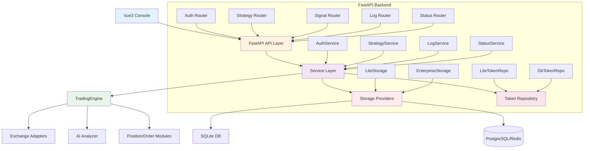

# Design Document

## Overview

为 DeepSeek 加密货币交易机器人构建一个完整的 API 管理控制台系统，包含 FastAPI RESTful API 层和 Vue3 + Element Plus Web 界面。该系统采用双轨存储架构（Lite/Enterprise），与现有交易引擎同进程运行，提供策略控制、参数管理、实时信号查询、日志查看等核心运维功能。

系统定位：作为交易机器人的运维管理面，提供生产级可视化监控和控制能力，同时保持架构的简洁性和可扩展性。

## Steering Document Alignment

### Technical Standards

本项目遵循以下技术标准：
- **服务器框架**: FastAPI（异步高性能，自动 OpenAPI 文档生成）
- **认证机制**: Bearer Token + RBAC 角色权限控制
- **存储抽象**: StorageProvider/TokenRepository 接口，支持双模式实现
- **日志架构**: 多 Sink 设计（Stdout + File + SQLite + 可选 Elastic）
- **前后端分离**: RESTful API + Vue3 SPA，通过 Axios 通信
- **配置管理**: Pydantic Settings + 环境变量优先级
- **类型安全**: 全链路类型注解，FastAPI 自动校验请求/响应

### Project Structure

遵循现有 BMad 项目的 5 层模块化架构：
- `src/api/` - FastAPI 路由、依赖注入、Schema 定义
- `src/storage/` - 存储抽象接口与实现（Lite/Enterprise 双模式）
- `src/services/` - 业务逻辑服务层（策略、日志、认证等）
- `src/schemas/` - Pydantic 请求/响应模型
- `frontend/` - Vue3 + Element Plus 独立前端项目

## Code Reuse Analysis

### Existing Components to Leverage

- **`src/config/config_manager.py`**: Config 类提供统一配置管理，API 层可直接使用 `get_config()` 获取运行时配置
- **`src/trading_engine.py`**: TradingEngine 提供 `start/stop/update_config` 控制接口，StrategyService 将封装调用
- **`src/utils/daily_limit_manager.py`**: SQLite 存储实现可作为参考，StorageProvider 接口将兼容现有 `trade_records` 表结构
- **`src/utils/logger.py`**: 现有 logging 模块将扩展支持 FileHandler 和 SQLiteLogSink，保留现有接口

### Integration Points

- **TradingEngine 控制钩子**: 新增 `control/start()`, `control/stop()`, `control/update_params()` 方法
- **信号历史缓存**: 复用 `TradingEngine.signal_history` 内存列表，提供只读访问接口
- **配置热更新**: 在 `Config` 类中实现 `update_field()` 方法，支持运行时参数修改
- **日志双写**: 在 `logger.get_logger()` 返回的 Logger 实例上动态添加 Handler，不影响现有日志调用

## Architecture

### 整体架构



### 模块化设计原则

- **Single File Responsibility**: 每个文件单一职责（`routers/auth.py` 只处理认证，`services/strategy.py` 只处理策略逻辑）
- **Component Isolation**: API 路由、业务服务、数据访问三层分离，通过依赖注入解耦
- **Service Layer Separation**: Service 层封装所有业务逻辑，Router 层只负责 HTTP 请求/响应处理
- **Storage Abstraction**: StorageProvider 接口屏蔽 Lite/Enterprise 实现差异，API 层无感知

## Components and Interfaces

### Component 1: FastAPI Application (`src/api/app.py`)

**Purpose**: FastAPI 应用入口，配置中间件、路由、异常处理

**Interfaces**:
- `create_app() -> FastAPI`: 工厂函数创建应用实例
- 内置 OpenAPI/Swagger 文档自动生成
- 全局异常处理器统一错误格式

**Dependencies**:
- 所有 Router 模块
- Storage/Token 配置

**Reuses**: FastAPI 内置的依赖注入和自动文档生成

### Component 2: Auth Router (`src/api/routers/auth.py`)

**Purpose**: Token 认证和用户管理接口

**Interfaces**:
- `POST /api/auth/login`: 验证 Token，返回角色信息
- `POST /api/users/token`: 管理员创建普通用户 Token
- `GET /api/users/token`: 分页列出用户 Token
- `DELETE /api/users/token/{token}`: 吊销 Token

**Dependencies**:
- TokenRepository (根据配置注入 Lite 或 Db 实现)
- Config (读取 ADMIN_TOKEN)

**Reuses**: 现有配置系统中的 API 密钥管理机制

### Component 3: Strategy Router (`src/api/routers/strategy.py`)

**Purpose**: 策略启停控制和参数管理

**Interfaces**:
- `GET /api/strategy`: 列出所有策略状态
- `POST /api/strategy/{id}/start`: 启动策略
- `POST /api/strategy/{id}/stop`: 停止策略
- `PATCH /api/strategy/{id}/params`: 更新参数
- `GET /api/strategy/{id}`: 查看策略详情

**Dependencies**:
- StrategyService (封装 TradingEngine 调用)
- Auth 依赖（管理员权限校验）

**Reuses**: 现有 TradingEngine 的控制钩子

### Component 4: Log Router (`src/api/routers/logs.py`)

**Purpose**: 日志查询和实时推送

**Interfaces**:
- `GET /api/logs`: 分页查询日志（支持 level/type/keyword/time 过滤）
- `GET /api/logs/stream`: SSE 实时推送新日志

**Dependencies**:
- LogService（封装 StorageProvider 日志查询）

**Reuses**: 扩展后的 logger 模块（FileHandler + SQLiteLogSink）

### Component 5: Storage Provider Interface (`src/storage/interfaces.py`)

**Purpose**: 定义存储抽象协议

**Interfaces (Protocol)**:
- `get_trade_records(filters: TradeQuery) -> List[TradeRecord]`
- `append_trade_record(record: TradeRecord) -> None`
- `get_daily_stats(date: str) -> DailyStats`
- `save_log(entry: LogEntry) -> None`
- `query_logs(query: LogQuery) -> List[LogEntry]`

**Dependencies**: 无（纯协议定义）

**Reuses**: 现有 `TradeRecord` dataclass 和日志格式

### Component 6: Lite Storage (`src/storage/lite_storage.py`)

**Purpose**: 轻量级存储实现（SQLite + JSON）

**Interfaces**: 实现 StorageProvider Protocol

**Dependencies**:
- SQLite 连接池（复用 existing daily_limit_manager）
- JSON 文件操作（user_tokens.json）

**Reuses**: 现有 `data/daily_limits.db` 连接逻辑

### Component 7: Token Repository Interface (`src/storage/token_repo.py`)

**Purpose**: Token 管理抽象协议

**Interfaces (Protocol)**:
- `create_user_token(user_id: str, scopes: List[str], expires_at: datetime|None) -> TokenInfo`
- `revoke_token(token: str) -> None`
- `validate_token(token: str) -> TokenInfo|None`
- `list_tokens() -> List[TokenInfo]`

**Dependencies**: 无（纯协议定义）

### Component 8: Vue3 Console (`frontend/`)

**Purpose**: Web 管理界面

**Pages**:
- Dashboard.vue - 仪表盘
- Strategy.vue - 策略管理
- Logs.vue - 日志中心
- Users.vue - 用户管理（Admin）
- Login.vue - 登录页

**Stores (Pinia)**:
- authStore - 认证状态
- dashboardStore - 仪表盘数据
- strategyStore - 策略管理
- logStore - 日志查询

**Dependencies**:
- Element Plus UI 组件库
- Axios HTTP 客户端
- 后端 API

## Data Models

### TokenInfo (Pydantic Model)

```python
class TokenInfo(BaseModel):
    token: str = Field(..., min_length=16)
    label: str = Field(..., max_length=100)
    scopes: List[str] = Field(default_factory=list)
    status: Literal["active", "revoked"] = "active"
    created_at: datetime
    last_used_at: Optional[datetime] = None
    expires_at: Optional[datetime] = None

    class Config:
        schema_extra = {
            "example": {
                "token": "user_7b9b0c1d",
                "label": "qa observer",
                "scopes": ["logs:read", "signals:read"],
                "status": "active",
                "created_at": "2025-11-19T10:30:00Z",
                "expires_at": "2025-11-26T10:30:00Z"
            }
        }
```

### StrategyStatus (Pydantic Model)

```python
class StrategyStatus(BaseModel):
    id: str
    name: str
    status: Literal["running", "stopped", "error"]
    timeframe: str
    mode: Literal["test", "live"]
    current_params: Dict[str, Any]
    last_signal: Optional[Dict[str, Any]] = None
    metrics: Dict[str, float]
```

### LogEntry (Pydantic Model)

```python
class LogEntry(BaseModel):
    id: int
    timestamp: datetime
    level: Literal["DEBUG", "INFO", "WARNING", "ERROR", "CRITICAL"]
    type: Literal["system", "trade"]
    module: str
    message: str
    metadata: Optional[Dict[str, Any]] = None
```

### LogQuery (Pydantic Model)

```python
class LogQuery(BaseModel):
    type: Optional[Literal["system", "trade"]] = None
    level: Optional[Literal["DEBUG", "INFO", "WARNING", "ERROR", "CRITICAL"]] = None
    keyword: Optional[str] = None
    from_time: Optional[datetime] = None
    to_time: Optional[datetime] = None
    page: int = Field(default=1, ge=1)
    page_size: int = Field(default=50, ge=1, le=200)
```

## Error Handling

### Error Scenarios

1. **Scenario 1: 无效 Token 访问**
   - **Handling**: `Depends(get_current_user)` 校验失败，抛出 `HTTPException(status_code=401)`
   - **User Impact**: 前端跳转登录页，提示"会话已过期，请重新登录"

2. **Scenario 2: 权限不足**
   - **Handling**: 检查用户角色，抛出 `HTTPException(status_code=403, detail="Insufficient permissions")`
   - **User Impact**: 前端显示"无权操作"提示，隐藏管理按钮

3. **Scenario 3: 参数验证失败**
   - **Handling**: Pydantic 自动校验，返回 `422 Unprocessable Entity` 及详细错误信息
   - **User Impact**: 前端表单高亮错误字段，显示具体错误消息

4. **Scenario 4: 策略操作失败**
   - **Handling**: 捕获 TradingEngine 异常，返回 `500 Internal Server Error` 及错误详情
   - **User Impact**: 前端显示"操作失败，请重试"，记录错误日志

5. **Scenario 5: 存储服务不可用**
   - **Handling**: 捕获 SQLite/PostgreSQL 连接错误，返回 `503 Service Unavailable`
   - **User Impact**: 前端显示"系统维护中，请稍后再试"，启用降级模式

## Testing Strategy

### Unit Testing

- **Auth Router**: Token 验证、权限检查、Token 生成/吊销逻辑
- **StrategyService**: 策略启停控制、参数更新、状态查询
- **Storage Providers**: 读写操作、错误处理、并发安全
- **Token Repositories**: Token 生命周期管理、文件锁机制
- **Pydantic Models**: 输入验证、序列化/反序列化

**工具**: pytest, pytest-asyncio (FastAPI 异步测试), pytest-mock

### Integration Testing

- **API Integration**: 从 Router → Service → TradingEngine 完整调用链
- **认证授权**: Token 传递、角色校验、权限隔离
- **存储切换**: Lite/Enterprise 模式无缝切换验证
- **配置热更新**: 参数修改后 TradingEngine 行为验证

**工具**: pytest, httpx.AsyncClient (FastAPI TestClient)

### End-to-End Testing

**关键流程**:
1. 管理员登录 → 创建普通用户 Token → 普通用户访问受限资源
2. 查询策略状态 → 启动策略 → 查看实时信号 → 停止策略
3. 修改策略参数 → 验证参数生效 → 查看更新日志
4. 查询日志 → 过滤级别/时间 → 查看日志详情
5. SSE 实时推送：订阅日志流 → 触发新日志 → 接收推送

**工具**: Playwright (Vue3 前端测试), pytest (API 测试)

### 性能测试

- **并发用户**: 模拟 10+ 用户同时访问控制台
- **响应时间**: API 接口平均响应 < 200ms，P95 < 500ms
- **数据库查询**: 日志查询优化，索引覆盖过滤条件
- **SSE 压力**: 100+ 客户端同时订阅，延迟 < 5s

**工具**: locust (负载测试), pytest-benchmark
