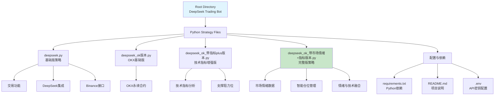

# DeepSeek 加密货币交易机器人

## 项目愿景

基于 DeepSeek AI 的自动化加密货币交易系统，通过技术指标分析和市场情绪数据，实现 BTC/USDT 合约的智能交易决策。项目采用多版本迭代策略，从基础版本到包含市场情绪和智能仓位管理的增强版本。

## 架构概览

### 核心技术栈
- **AI 分析引擎**: DeepSeek Chat API - 用于市场趋势分析和交易信号生成
- **交易接口**: CCXT 库 - 支持 Binance 和 OKX 交易所
- **数据处理**: Pandas - K线数据处理和技术指标计算
- **任务调度**: Schedule - 定时执行交易策略
- **环境管理**: Python-dotenv - API密钥管理

### 数据流架构
```
市场数据获取 → 技术指标计算 → DeepSeek AI分析 → 交易信号生成 → 订单执行 → 持仓监控
```

### Mermaid 结构图



## 模块索引

| 模块 | 路径 | 职责 | 关键特性 |
|------|------|------|----------|
| **交易策略核心** | `deepseek.py` | 基础版Binance交易策略 | 基础K线分析、DeepSeek集成、单向持仓 |
| **OKX基础版** | `deepseek_ok版本.py` | OKX交易所基础适配 | 合约交易、全仓模式、15分钟周期 |
| **技术指标增强版** | `deepseek_ok_带指标plus版本.py` | 完整技术分析模块 | SMA/EMA、MACD、RSI、布林带、支撑阻力 |
| **完整策略版** | `deepseek_ok_带市场情绪+指标版本.py` | 最全功能策略 | 市场情绪API、智能仓位、反转防护、整点执行 |
| **项目配置** | `README.md` / `requirements.txt` | 项目文档与依赖 | 环境搭建说明、依赖管理 |

## 运行环境与开发

### 系统要求
- Python 3.10+
- Ubuntu/Linux 服务器（推荐阿里云香港/新加坡）
- Anaconda 或 Miniconda 环境管理

### 安装步骤
```bash
# 1. 创建conda环境
conda create -n ds python=3.10
conda activate ds

# 2. 安装依赖
pip install -r requirements.txt

# 3. 配置环境变量
# 创建 .env 文件并配置API密钥
DEEPSEEK_API_KEY=your_deepseek_key
BINANCE_API_KEY=your_binance_key
BINANCE_SECRET=your_binance_secret
OKX_API_KEY=your_okx_key
OKX_SECRET=your_okx_secret
OKX_PASSWORD=your_okx_password

# 4. 运行策略
python deepseek_ok_带市场情绪+指标版本.py  # 推荐使用完整版
```

### 配置说明

#### 交易参数 (`TRADE_CONFIG`)
- **交易对**: `BTC/USDT:USDT` (OKX永续合约)
- **杠杆倍数**: 10x
- **时间周期**: 15分钟K线
- **数据点**: 96个 (24小时历史数据)
- **测试模式**: 支持模拟交易

#### 智能仓位管理
```python
'position_management': {
    'enable_intelligent_position': True,
    'base_usdt_amount': 100,
    'high_confidence_multiplier': 1.5,
    'medium_confidence_multiplier': 1.0,
    'low_confidence_multiplier': 0.5,
    'max_position_ratio': 10,
    'trend_strength_multiplier': 1.2
}
```

## 测试策略

### 测试模式
- `test_mode: True` - 模拟交易，不执行真实订单
- **推荐**: 首次运行时务必启用测试模式

### 回测验证
- 使用历史K线数据验证策略逻辑
- 重点测试技术指标计算准确性
- 验证DeepSeek分析结果合理性

### 风险控制测试
- 模拟极端市场条件
- 测试断网重连恢复机制
- 验证持仓检查逻辑

## 编码规范

### 核心原则
1. **单向持仓**: 所有版本统一使用单向持仓模式
2. **全仓模式**: 避免逐仓风险
3. **防频繁交易**: 连续信号检查和反转保护
4. **数据验证**: 所有外部数据都需要安全检查

### 错误处理
- **API调用失败**: 自动重试机制（最多2次）
- **JSON解析失败**: 安全解析和备用信号生成
- **网络异常**: 完整异常追踪和日志记录

### 日志输出
- 交易信号详细记录
- 技术指标实时显示
- 持仓状态跟踪
- 错误信息完整输出

## AI 使用指南

### DeepSeek 提示词设计
每个版本都有精心设计的系统提示词：
- **角色设定**: 专业交易员背景（情感化设定）
- **分析重点**: 技术分析为主，市场情绪为辅
- **输出格式**: 严格的JSON格式要求
- **温度参数**: 0.1（低随机性，保证一致性）

### 市场情绪数据
- **数据源**: CryptOracle API (CO-A-02-01, CO-A-02-02)
- **更新频率**: 15分钟
- **使用权重**: 30% (技术分析60%, 风险管理10%)

### 决策流程
1. **数据收集**: K线 + 技术指标 + 情绪数据
2. **综合分析**: DeepSeek AI 多维度评估
3. **信号生成**: BUY/SELL/HOLD + 信心等级
4. **风险验证**: 信心度检查 + 持仓状态
5. **订单执行**: 智能仓位计算 + 交易所API

## 版本演进

### v1.0 - 基础版 (`deepseek.py`)
- ✅ 基础K线数据获取
- ✅ DeepSeek集成
- ✅ Binance接口
- ✅ 基础交易逻辑

### v2.0 - OKX版 (`deepseek_ok版本.py`)
- ✅ OKX永续合约适配
- ✅ 合约规格处理
- ✅ 全仓模式设置

### v3.0 - 技术指标版 (`deepseek_ok_带指标plus版本.py`)
- ✅ 完整技术指标库 (SMA, EMA, MACD, RSI, 布林带)
- ✅ 支撑阻力位计算
- ✅ 趋势分析框架
- ✅ 增强数据处理

### v4.0 - 完整版 (`deepseek_ok_带市场情绪+指标版本.py`)
- ✅ 市场情绪数据集成
- ✅ 智能仓位管理系统
- ✅ 防频繁交易机制
- ✅ 整点定时执行
- ✅ 备用信号生成
- ✅ 高可用性设计

## 变更日志 (Changelog)

### 2025-11-05
- ✨ **重大更新**: 完整版策略发布
  - 新增智能仓位管理，根据信心度动态调整仓位
  - 集成市场情绪数据API (CryptOracle)
  - 实现防频繁交易机制和连续信号检测
  - 添加整点定时执行功能 (15分钟周期)
  - 完善错误处理和备用信号生成
  - 优化持仓模式：强制单向持仓 + 全仓模式

- 🔧 **技术优化**:
  - 重构 `calculate_intelligent_position()` 函数
  - 增强 `get_sentiment_indicators()` 数据解析
  - 优化 `execute_intelligent_trade()` 交易逻辑
  - 修复JSON解析问题，添加安全解析函数

- 📊 **新增指标**:
  - 成交量比例分析
  - 布林带位置百分比
  - 多周期均线系统
  - MACD柱状图分析

### 历史版本
- **2025-11-05**: v3.0 技术指标增强版发布
- **2025-11-05**: v2.0 OKX适配版发布
- **2025-11-05**: v1.0 基础版发布

## 风险警示

⚠️ **重要声明**:
- 本项目为实验性交易系统，不构成投资建议
- 实盘交易存在资金损失风险，请谨慎使用
- 建议在测试环境中充分验证后再用于实盘
- 开发者不对任何交易损失承担责任

🔒 **安全建议**:
- 妥善保管API密钥，建议使用专用交易账户
- 启用测试模式进行充分验证
- 设置合理的止损止盈参数
- 定期检查持仓状态和交易日志
- 建议初始使用小仓位测试策略有效性

---

**项目作者**: 火鸡传奇 (Twitter: @huojichuanqi)
**更新时间**: 2025-11-05 11:26:39
