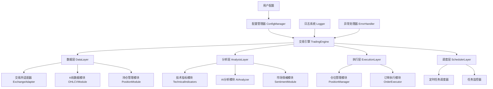
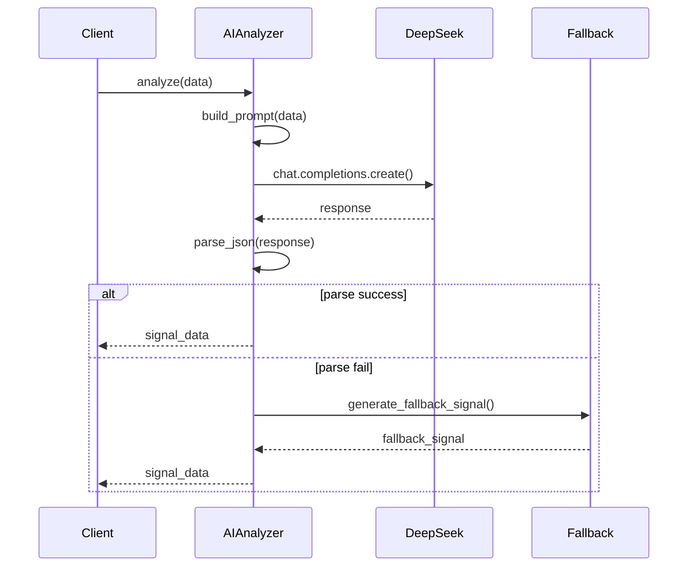
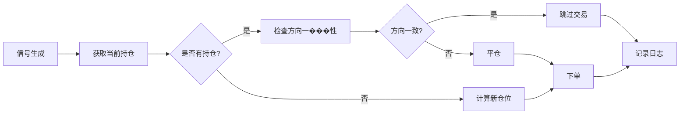
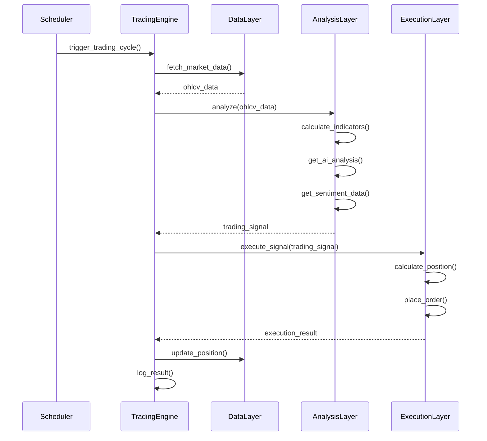

# DeepSeek 交易机器人系统架构

## 架构概览

### 设计原则

1. **模块化设计** - 每个功能独立模块，低耦合高内聚
2. **配置驱动** - 所有参数可配置，适应不同策略需求
3. **错误隔离** - 单个模块失败不影响整体系统
4. **可扩展性** - 易于添加新交易所、新指标、新策略
5. **可测试性** - 每个模块可独立单元测试

### 整体架构图



---

## 分层架构设计

### 1. 数据层 (Data Layer)

**职责**: 数据获取、存储和管理

#### 1.1 交易所适配器 (ExchangeAdapter)
**文件**: `src/exchanges/base.py`

```python
class ExchangeAdapter(ABC):
    """交易所适配器抽象基类"""

    @abstractmethod
    def fetch_ohlcv(self, symbol, timeframe, limit):
        """获取K线数据"""

    @abstractmethod
    def fetch_positions(self, symbol):
        """获取持仓信息"""

    @abstractmethod
    def create_order(self, symbol, side, amount, params):
        """创建订单"""

    @abstractmethod
    def set_leverage(self, leverage, symbol):
        """设置杠杆"""

    @abstractmethod
    def set_position_mode(self, hedged, symbol):
        """设置持仓模式"""
```

**实现**:
- `src/exchanges/binance_adapter.py` - Binance 适配器
- `src/exchanges/okx_adapter.py` - OKX 适配器

**优势**:
- 统一交易接口
- 易于添加新交易所
- 隔离交易所差异

#### 1.2 K线数据模块 (OHLCVModule)
**文件**: `src/data/ohlcv.py`

**功能**:
- 获取历史K线数据
- 数据清洗和格式化
- 实时数据更新
- 数据缓存机制

**核心方法**:
```python
def get_ohlcv_data(symbol, timeframe, limit=96):
    """获取K线数据"""

def format_ohlcv_df(ohlcv_list):
    """格式化DataFrame"""

def get_current_price(exchange):
    """获取当前价格"""
```

#### 1.3 持仓管理模块 (PositionModule)
**文件**: `src/data/position.py`

**功能**:
- 实时持仓状态查询
- 持仓历史记录
- 持仓盈亏计算
- 持仓变化跟踪

---

### 2. 分析层 (Analysis Layer)

**职责**: 技术分析、AI分析和信号生成

#### 2.1 技术指标模块 (TechnicalIndicators)
**文件**: `src/analysis/indicators.py`

**指标清单**:

| 指标 | 参数 | 用途 |
|------|------|------|
| **SMA** | 5, 20, 50, 96 | 趋势判断 |
| **EMA** | 12, 26 | 平滑移动平均 |
| **MACD** | 12, 26, 9 | 趋势和动量 |
| **RSI** | 14 | 超买超卖 |
| **Bollinger Bands** | 20, 2 | 波动性和支撑阻力 |
| **Support/Resistance** | 20 | 关键价位 |

**代码结构**:
```python
class TechnicalIndicators:
    """技术指标计算引擎"""

    @staticmethod
    def sma(data, period):
        """简单移动平均线"""

    @staticmethod
    def ema(data, period):
        """指数移动平均线"""

    @staticmethod
    def macd(data, fast=12, slow=26, signal=9):
        """MACD指标"""

    @staticmethod
    def rsi(data, period=14):
        """RSI相对强弱指标"""

    @staticmethod
    def bollinger_bands(data, period=20, std=2):
        """布林带"""

    @staticmethod
    def support_resistance(data, lookback=20):
        """支撑阻力位计算"""

    @staticmethod
    def market_trend(data, short=20, long=50):
        """市场趋势分析"""
```

#### 2.2 AI分析模块 (AIAnalyzer)
**文件**: `src/analysis/ai_analyzer.py`

**功能**:
- DeepSeek API 集成
- 结构化提示词管理
- JSON 响应解析
- 错误处理和重试
- 备用信号生成

**核心流程**:


**提示词模板**:
```python
SYSTEM_PROMPT = """
你是一位专业的加密货币交易分析师。
专注于 {timeframe} 周期趋势分析。
结合技术指标、K线形态、支撑阻力做判断。
"""

USER_PROMPT_TEMPLATE = """
【K线数据】
{kline_data}

【技术指标】
{indicators}

【市场情绪】
{sentiment}

【当前持仓】
{position}

请用JSON格式回复：
{json_format}
"""
```

#### 2.3 市场情绪模块 (SentimentModule)
**文件**: `src/analysis/sentiment.py`

**功能**:
- CryptOracle API 集成
- 情绪数据获取和解析
- 数据缓存 (15分钟)
- 权重计算

---

### 3. 执行层 (Execution Layer)

**职责**: 仓位管理和订单执行

#### 3.1 仓位管理模块 (PositionManager)
**文件**: `src/execution/position_manager.py`

**智能仓位算法**:
```python
def calculate_position_size(confidence, trend_strength, base_amount):
    """
    智能仓位计算

    基础公式:
    size = base_amount × confidence_multiplier × trend_multiplier

    confidence_multiplier:
    - HIGH: 1.5
    - MEDIUM: 1.0
    - LOW: 0.5

    trend_multiplier:
    - 强趋势: 1.2
    - 一般趋势: 1.0
    """
```

**流程图**:


#### 3.2 订单执行模块 (OrderExecutor)
**文件**: `src/execution/order_executor.py`

**功能**:
- 订单创建和提交
- 订单状态跟踪
- 止损止盈设置
- 异常处理和重试

**订单类型**:
```python
ORDER_TYPES = {
    'market': '市价单',
    'limit': '限价单',
    'stop_loss': '止损单',
    'take_profit': '止盈单'
}
```

---

### 4. 调度层 (Scheduler Layer)

**职责**: 任务调度和监控

#### 4.1 定时任务调度器
**文件**: `src/scheduler/job_scheduler.py`

**功能**:
- 多时间周期支持 (15m, 1h, 4h)
- 整点执行控制
- 任务状态管理
- 优雅关闭

**时间表**:
```python
TIMEFRAME_CONFIGS = {
    '15m': {
        'interval': 15,  # 分钟
        'offset': 1,     # 执行偏移秒
    },
    '1h': {
        'cron': '0 * * * *',  # 每小时整点
    },
    '4h': {
        'cron': '0 0,4,8,12,16,20 * * *',
    }
}
```

#### 4.2 任务监控器
**文件**: `src/scheduler/task_monitor.py`

**功能**:
- 任务执行状态跟踪
- 异常检测和告警
- 性能指标统计
- 资源使用监控

---

### 5. 配置管理层

**文件**: `src/config/config_manager.py`

**配置项**:
```python
class Config:
    """系统配置"""

    # 交易配置
    TRADE_CONFIG = {
        'symbol': 'BTC/USDT:USDT',
        'leverage': 10,
        'timeframe': '15m',
        'test_mode': True,
    }

    # 技术指标配置
    INDICATOR_CONFIG = {
        'sma_periods': [5, 20, 50, 96],
        'ema_periods': [12, 26],
        'rsi_period': 14,
        'bb_period': 20,
        'bb_std': 2,
    }

    # AI分析配置
    AI_CONFIG = {
        'model': 'deepseek-chat',
        'temperature': 0.1,
        'max_retries': 2,
        'timeout': 10,
    }

    # 仓位管理配置
    POSITION_CONFIG = {
        'base_usdt_amount': 100,
        'high_confidence_multiplier': 1.5,
        'medium_confidence_multiplier': 1.0,
        'low_confidence_multiplier': 0.5,
        'max_position_ratio': 10,
    }
```

---

## 文件结构设计

```
src/
├── config/
│   ├── __init__.py
│   ├── config_manager.py      # 配置管理
│   └── settings.py            # 默认设置
├── exchanges/
│   ├── __init__.py
│   ├── base.py                # 适配器基��
│   ├── binance_adapter.py     # Binance实现
│   └── okx_adapter.py         # OKX实现
├── data/
│   ├── __init__.py
│   ├── ohlcv.py               # K线数据
│   ├── position.py            # 持仓管理
│   └── cache.py               # 数据缓存
├── analysis/
│   ├── __init__.py
│   ├── indicators.py          # 技术指标
│   ├── ai_analyzer.py         # AI分析
│   └── sentiment.py           # 市场情绪
├── execution/
│   ├── __init__.py
│   ├── position_manager.py    # 仓位管理
│   └── order_executor.py      # 订单执行
├── scheduler/
│   ├── __init__.py
│   ├── job_scheduler.py       # 任务调度
│   └── task_monitor.py        # 任务监控
├── utils/
│   ├── __init__.py
│   ├── logger.py              # 日志系统
│   ├── error_handler.py       # 异常处理
│   └── json_parser.py         # JSON解析
└── trading_engine.py          # 主交易引擎

tests/
├── unit/                      # 单元测试
├── integration/               # 集成测试
└── fixtures/                  # 测试数据

docs/
├── prd/                       # 需求文档
├── architecture/              # 架构文档
├── api/                       # 接口文档
└── deployment/                # 部署文档
```

---

## 核心工作流程

### 主交易流程



---

## 错误处理策略

### 异常层级

```
TradingSystemError (根异常)
├── ExchangeError (交易所相关)
│   ├── APIError
│   ├── NetworkError
│   └── RateLimitError
├── DataError (数据相关)
│   ├── OHLCVFetchError
│   ├── DataParseError
│   └── CacheError
├── AnalysisError (分析相关)
│   ├── IndicatorError
│   ├── AIAnalysisError
│   └── SentimentError
├── ExecutionError (执行相关)
│   ├── OrderError
│   ├── PositionError
│   └── InsufficientBalanceError
└── ConfigError (配置相关)
    ├── MissingParameterError
    └── InvalidValueError
```

### 重试机制

```python
RETRY_POLICIES = {
    'APIError': {
        'max_retries': 2,
        'backoff_factor': 2,
        'retry_on_status': [429, 500, 502, 503, 504]
    },
    'NetworkError': {
        'max_retries': 3,
        'backoff_factor': 1.5,
        'retry_on_status': [0, 1, 2]
    }
}
```

---

## 性能优化策略

### 1. 数据缓存
- K线数据本地缓存 (避免重复API调用)
- 技术指标结果缓存
- 市场情绪数据缓存 (15分钟)

### 2. 并发控制
- 异步IO处理 (aiohttp)
- 连接池复用
- 请求限流

### 3. 内存管理
- 限制历史数据大小 (96个数据点)
- 定期清理过期缓存
- 对象池复用

---

## 测试策略

### 单元测试 (80%)

```python
# tests/unit/test_indicators.py
def test_sma_calculation():
    """测试SMA计算正确性"""

def test_macd_signal_generation():
    """测试MACD信号生成"""

# tests/unit/test_position_manager.py
def test_position_calculation():
    """测试仓位计算逻辑"""
```

### 集成测试 (15%)

```python
# tests/integration/test_trading_cycle.py
def test_full_trading_cycle():
    """测试完整交易周期"""

def test_error_recovery():
    """���试错误恢复机制"""
```

### E2E测试 (5%)

```python
# tests/e2e/test_main_workflow.py
def test_production_simulation():
    """模拟生产环境测试"""
```

---

## 部署架构

### 开发环境
```bash
python -m src.trading_engine.py
```

### 生产环境
```bash
# 使用进程管理
pm2 start src/trading_engine.py --name "deepseek-bot"

# 使用Docker
docker run -d --name deepseek-bot \
    -v .env:/app/.env \
    -v logs:/app/logs \
    deepseek-trading-bot
```

---

## 监控和告警

### 关键指标
- 交易信号频率
- 订单执行成功率
- API 响应时间
- 错误率统计
- 盈亏统计

### 告警规则
- 连续3次订单失败
- API 响应时间 > 5秒
- 信号生成异常
- 持仓状态异常

---

**文档版本**: v1.0
**创建日期**: 2025-11-05
**架构师**: 幽浮喵 (BMad Engineer)
**审核状态**: 待审核
